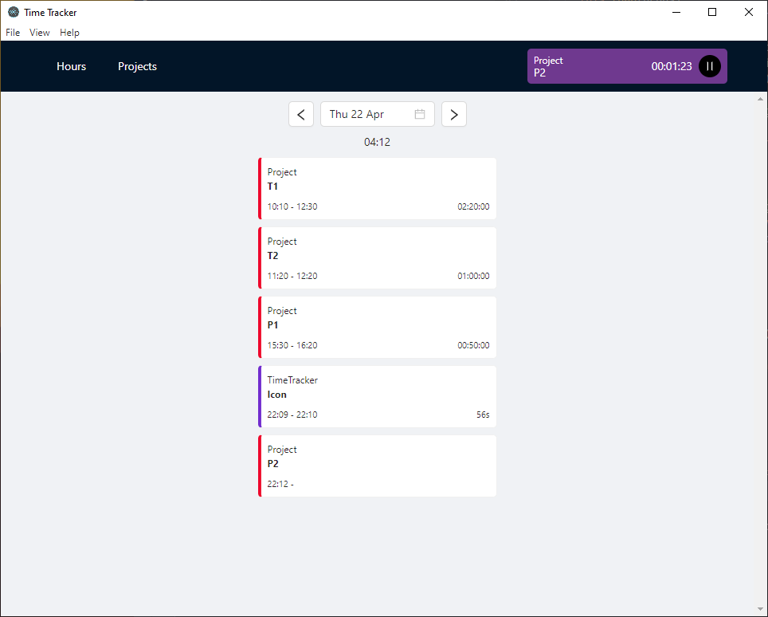
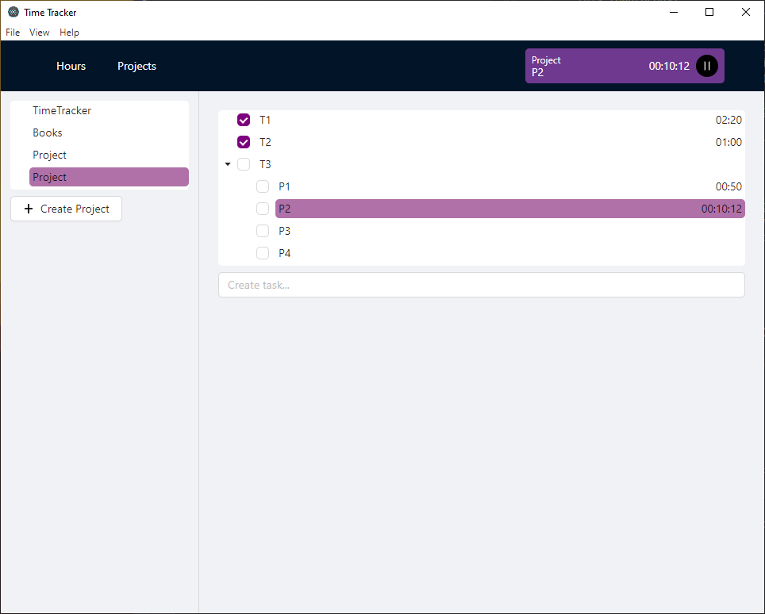
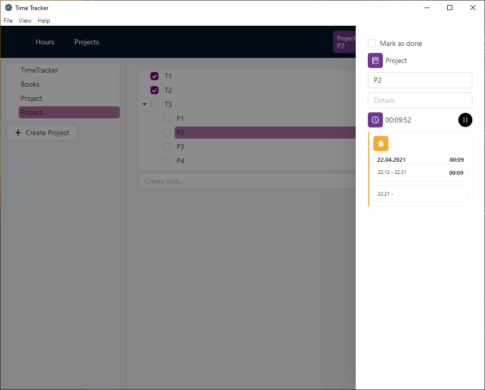

# Time Tracker

## Screenshots





## Starting Development

Start the app in the `dev` environment:

```bash
yarn start
```

## Packaging for Production

To package apps for the local platform:

```bash
yarn build
yarn package
```
